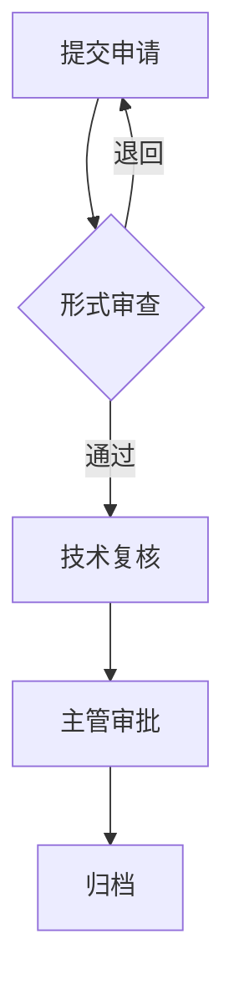
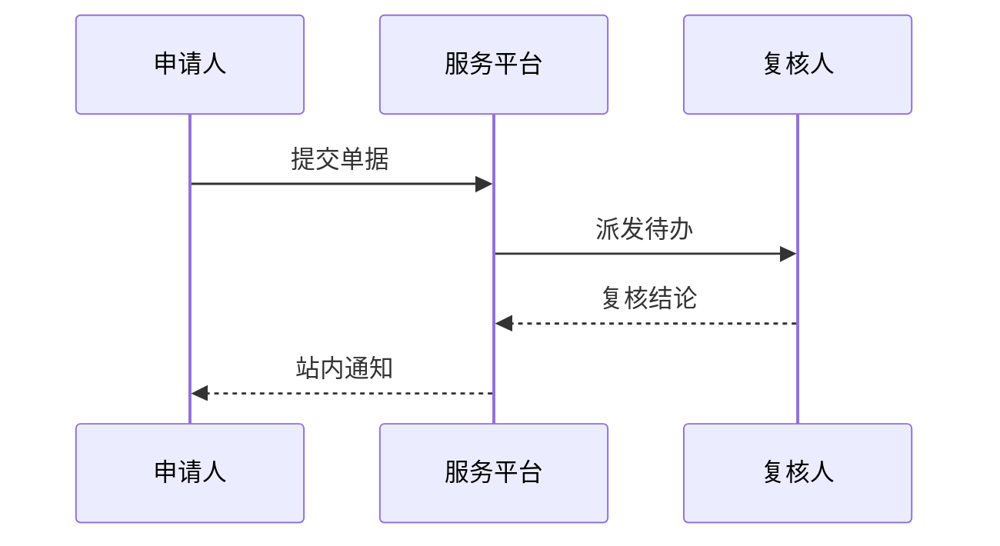
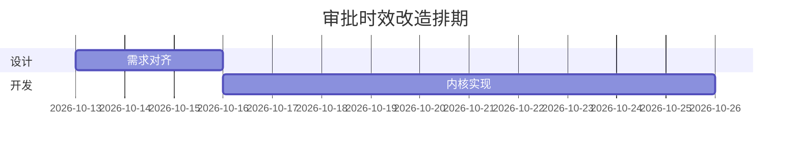

流程图（PRD 里最常见的一种）：

```mermaid
flowchart TD
    A[提交申请] --> B{形式审查}
    B -->|通过| C[技术复核]
    B -->|退回| A
    C --> D[主管审批]
    D --> E[归档]
```

时序图：

```mermaid
sequenceDiagram
    participant U as 申请人
    participant S as 服务平台
    participant R as 复核人
    U->>S: 提交单据
    S->>R: 派发待办
    R-->>S: 复核结论
    S-->>U: 站内通知
```

甘特图：

```mermaid
gantt
    title 审批时效改造排期
    dateFormat  YYYY-MM-DD
    section 设计
    需求对齐 :a1, 2026-10-13, 3d
    section 开发
    内核实现 :after a1, 10d
```
